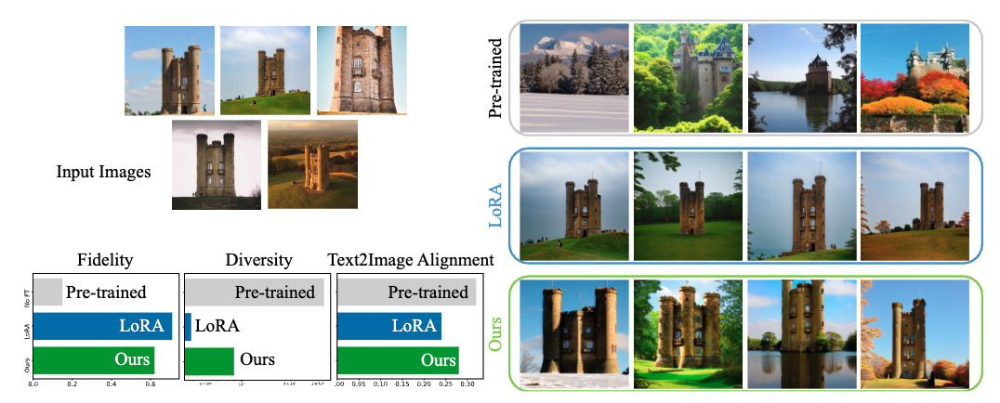
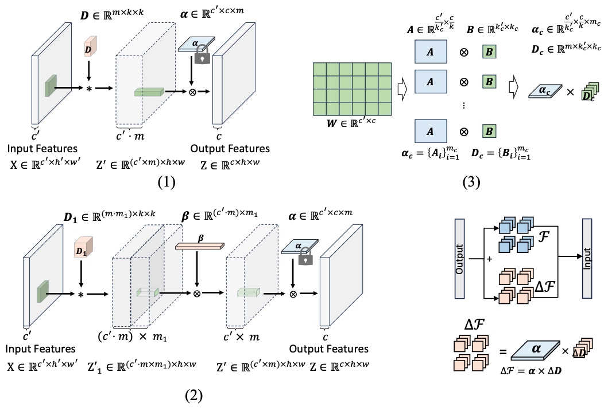

# ConvNet Efficient Fine-tuning
Implementation of (2025) ICLR "Large Convolutional Model Tuning via Filter Subspace"

Our study is inspired by prior research that represents each convolution filter as
a linear combination of a small set of filter subspace elements, referred to as filter atoms. In this paper, we propose to fine-tune pre-trained models by adjusting
only filter atoms, which are responsible for spatial-only convolution, while preserving spatially-invariant channel combination knowledge in atom coefficients.
In this way, we bring a new filter subspace view for model tuning. Furthermore,
each filter atom can be recursively decomposed as a combination of another set
of atoms, which naturally expands the number of tunable parameters in the filter
subspace. By only adapting filter atoms constructed by a small number of parameters, while maintaining the rest of model parameters constant, the proposed
approach is highly parameter-efficient. 



# Usage


### Set up environment
Install Pytorch
> conda install pytorch==2.5.0 torchvision==0.20.0 pytorch-cuda=12.4 -c pytorch -c nvidia

Install diffusers (for stable diffusion)
> pip install diffusers

### Inject ConvNet finetuning modules
Load pre-trained models such as ConvNeXt, ViT, Stable Diffusion, and replace the Conv2d or Linear with ConvNet finetuning modules.
> python inject_modules.py

### Example Code
This experiment provides different configurations of replacing Conv modules in the DNN. It provides various methods:



(1) fine-tuning filter atoms $\mathbf{D}$

(2) fine-tuning $\beta$ and $\mathbf{D}_1$

(3) fine-tuning bases in coefficients $\mathbf{D}_c$

(4) fine-tuning $\beta$ and $\mathbf{D}_1$, $\mathbf{D}_c$.
> bash run.sh


# Citation
If you find the paper and/or the code helpful, please cite us.
```
 @article{chen2024large,
  title={Large convolutional model tuning via filter subspace},
  author={Chen, Wei and Miao, Zichen and Qiu, Qiang},
  journal={International Conference on Learning Representations},
  year={2025}
}
```
